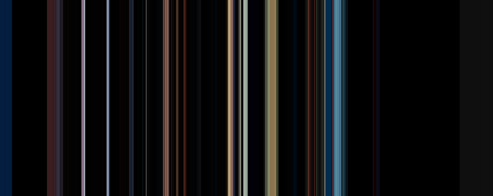
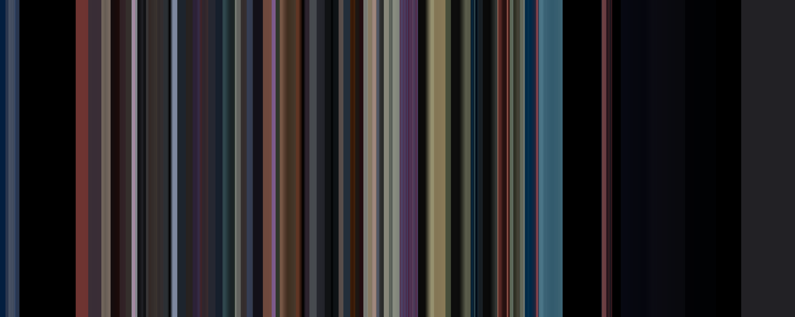
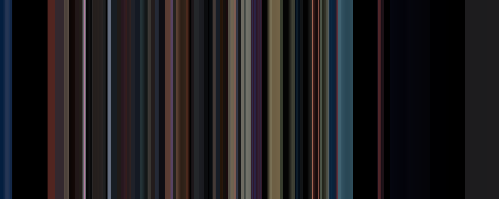

<h1 align="center">
  <b>movie_colorbar</b>
</h1>

A command line tool to create colorbars from videos.

## Install

The package requires `Python 3.10+` versions, and to have have [ffmpgeg][ffmpeg] installed in your path.

One can install from `PyPI` in a virtual enrivonment with:

```bash
python -m pip install movie_colorbar
```

<details> <summary><b>As a uv tool</b></summary>

The package also supports being installed as a tool with [uv][uv]:

```bash
uv tool install movie_colorbar
```

</details>

## Usage

Once installed, the package generates two executables (`colorbar` and `movie_colorbar`) to be called from the command line.

It can also be called directly through `python` or via the `uv tool` interface.

<details> <summary><b>Full command line interface</b></summary>

Detailed usage goes as follows:

```bash
 Usage: python -m movie_colorbar [OPTIONS] INPUT OUTPUT                                                                              
                                                                                                                                     
 Command line tool to create colorbars from videos.                                                                                  
 From the input video individual frames are extracted with ffmpeg and written to disk in a directory placed next to the final output 
 and named after the video. Each frame is reduced to a single color according to the chosen method. Finally a colorbar is created    
 from these determined colors, and written to disk as an image file at the provided output location. By default the extracted frames 
 are removed after processing, but they can be kept if desired (see the 'cleanup' option).                                           
 Should the input be a directory, then every video file contained within will be processed, provided it is supported by ffmpeg. In   
 this case the output should also be a directory, in which one colorbar will be created for each video file.                         
                                                                                                                                     
╭─ Arguments ───────────────────────────────────────────────────────────────────────────────────────────────────────────────────────╮
│ *    input       PATH  Path to the input video file or directory. [required]                                                      │
│ *    output      PATH  Path to the output colorbar image or directory. [required]                                                 │
╰───────────────────────────────────────────────────────────────────────────────────────────────────────────────────────────────────╯
╭─ Options ─────────────────────────────────────────────────────────────────────────────────────────────────────────────────────────╮
│ --method                                [common|hsv|hue|kmeans|lab|quantized|resize  Method used to calculate the color for each  │
│                                         |rgb|rgbsquared|xyz]                         frame.                                       │
│                                                                                      [default: rgb]                               │
│ --fps                                   INTEGER RANGE [x>=0]                         Number of frames to extract per second of    │
│                                                                                      video footage.                               │
│                                                                                      [default: 10]                                │
│ --cleanup               --no-cleanup                                                 Whether to remove the extracted frames after │
│                                                                                      processing.                                  │
│                                                                                      [default: cleanup]                           │
│ --log-level                             [trace|debug|info|warning|error|critical]    The base console logging level.              │
│                                                                                      [default: info]                              │
│ --install-completion                                                                 Install completion for the current shell.    │
│ --show-completion                                                                    Show completion for the current shell, to    │
│                                                                                      copy it or customize the installation.       │
│ --help                                                                               Show this message and exit.                  │
╰───────────────────────────────────────────────────────────────────────────────────────────────────────────────────────────────────╯
```

</details>

Here is an example command:

```bash
python -m movie_colorbar ~/Desktop/STARWARS_9_TRAILER.mkv ~/Desktop/colorbar.png --method rgbsquared --fps 25
```

One can also provide a directory as input (and must then provide a directory as output), which will process all video files found in this directory.

**Note:** It is recommended to decrease the fps when processing long videos such as entire movies.

## Output example

Here is an example of what the script outputs, when ran on the last [Star Wars 9 trailer](https://www.youtube.com/watch?v=P94M4jlrytQ).
All methods output can be found in the `bars` folder of this repository.

__Kmeans:__


__Rgb:__


__Rgbsquared:__


__Lab:__


---

<div align="center">
  <sub><strong>Made with ♥︎ by fsoubelet</strong></sub>
  <br>
  <sub><strong>MIT &copy 2019 Felix Soubelet</strong></sub>
</div>

[ffmpeg]: https://ffmpeg.org/
[uv]: https://docs.astral.sh/uv/guides/tools/